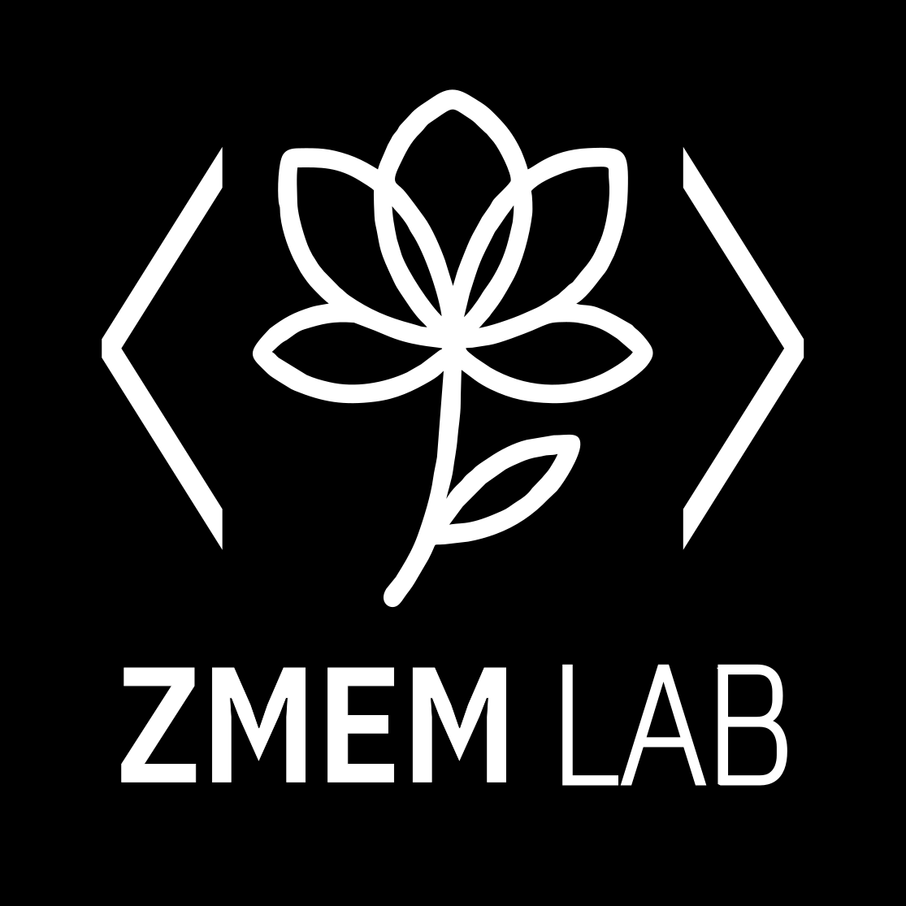

 

**Architectural research at the intersection of control theory, STS, and critical technical practice.**  
**Pesquisa arquitetural na interseção da teoria de controle, ECTS e prática técnica crítica.**

---

## 🇬🇧 EN Version

### What is ZMEM?

**ZMEM (Zero-Mean Execution Memory)** is an architectural concept — not a trademark or commercial entity. It names what current computational systems systematically exclude: the preservation of **"could still not happen"** as a system primitive.

$$
\text{ZMEM} = \{ \text{state } S \mid \text{intention}(S) \land \neg \text{irreversible}(S) \}
$$

| Component | Meaning |
|-----------|---------|
| `intention(S)` | Action is intended |
| `¬irreversible(S)` | Action can still be vetoed |

ZMEM is the computational representation of **decisional suspension** — the space between "yes" and "no" where ethics resides.

> *"A buffer organizes when an action happens. ZMEM preserves whether it should happen at all."*

---

### 🧬 The Code That Doesn't Compile — But Explains

```python
# resilience.py
from pain import transform
from hope import stubborn_persistence

class AlexandreSah:
    def __init__(self):
        self.credentials = "human being"
        self.lab = "the crucible of suffering" 
        self.funding = "infinite courage"
    
    def create_zmem(self):
        while self.still_breathing():
            idea = transform(self.pain)
            prototype = stubborn_persistence(idea)
            return prototype that saves others
```

> *"The author's lack of conventional credentials is not concealed — it is integral to the work's central claim."*

---

### 🏛️ Purpose of ZMEM Lab

ZMEM Lab exists to:

- **Formalize** architectural primitives for ethical AI (hysteresis, cognitive buffering, temporal sovereignty)
- **Implement** provably enforceable mechanisms (AHP, PoH-R, Δt-Prudential)
- **Bridge** control theory, STS, and decolonial critique
- **Democratize** access to rigorous research methods through open source
- **Preserve** the possibility of "not yet decided" in algorithmic governance

All materials — proofs, protocols, code, preprints — are **open and falsifiable**.

---

### 📚 Current Projects

| Project | Description |
|---------|-------------|
| [**Algorithmic Hysteresis Primacy (AHP)**](https://zmem.org) | Provably enforceable temporal governance framework |
| **ZMEM-Orchestrator** *(in planning)* | Open-source tool for ethical multi-LLM text refinement |

---

### 📄 Preprints

- Sah, A. (2026). *Algorithmic Hysteresis Primacy (AHP): Temporal Sovereignty in AI Governance*. SSRN.  
  [https://papers.ssrn.com/sol3/papers.cfm?abstract_id=6229958](https://papers.ssrn.com/sol3/papers.cfm?abstract_id=6229958)

---

### 🌐 Links

- 🌍 [https://zmem.org](https://zmem.org)
- 🐙 [GitHub](https://github.com/zmem-lab)

---

### ⚖️ Note on the Name

**ZMEM is an architectural concept — not a trademark.**  
It refers to Zero-Mean Execution Memory, as defined above. Any commercial use of the name is incidental and unrelated to this academic work.

---

## <a name="pt-version"></a>🇧🇷 Versão PT-BR

### O que é ZMEM?

**ZMEM (Zero-Mean Execution Memory / Memória de Execução de Média Zero)** é um conceito arquitetural — não uma marca ou entidade comercial. Ele nomeia o que os sistemas computacionais atuais excluem sistematicamente: a preservação do **"ainda pode não acontecer"** como primitiva de sistema.

$$
\text{ZMEM} = \{ \text{estado } S \mid \text{intenção}(S) \land \neg \text{irreversível}(S) \}
$$

| Componente | Significado |
|------------|-------------|
| `intenção(S)` | A ação é intencionada |
| `¬irreversível(S)` | A ação ainda pode ser vetada |

ZMEM é a representação computacional da **suspensão decisional** — o espaço entre o "sim" e o "não" onde a ética habita.

> *"Um buffer organiza quando uma ação acontece. ZMEM preserva se ela deve acontecer."*

---

### 🧬 O Código Que Não Compila — Mas Explica

```python
# resilience.py
from dor import transformar
from esperança import persistencia_teimosa

class AlexandreSah:
    def __init__(self):
        self.credenciais = "ser humano"
        self.laboratorio = "o cadinho do sofrimento"
        self.financiamento = "coragem infinita"
    
    def criar_zmem(self):
        while self.ainda_respirando():
            ideia = transformar(self.dor)
            prototipo = persistencia_teimosa(ideia)
            return prototipo que salva outros
```

> *"A ausência de credenciais acadêmicas tradicionais não é omitida — é parte constitutiva da tese central deste trabalho."*

---

### 🏛️ Propósito do ZMEM Lab

O ZMEM Lab existe para:

- **Formalizar** primitivas arquiteturais para IA ética (histerese, buffering cognitivo, soberania temporal)
- **Implementar** mecanismos formalmente verificáveis (AHP, PoH-R, Δt-Prudential)
- **Integrar** teoria de controle, ECTS e crítica decolonial
- **Democratizar** o acesso a métodos rigorosos de pesquisa através de código aberto
- **Preservar** a possibilidade do "ainda não decidido" na governança algorítmica

Todos os materiais — provas, protocolos, código, preprints — são **abertos e falseáveis**.

---

### 📚 Projetos Atuais

| Projeto | Descrição |
|---------|-----------|
| [**Primazia da Histerese Algorítmica (AHP)**](https://zmem.org) | Framework de governança temporal formalmente verificável |
| **ZMEM-Orchestrator** *(em planejamento)* | Ferramenta open-source para refinamento ético de textos com múltiplas LLMs |

---

### 📄 Preprints

- Sah, A. (2026). *Algorithmic Hysteresis Primacy (AHP): Temporal Sovereignty in AI Governance*. SSRN.  
  [https://papers.ssrn.com/sol3/papers.cfm?abstract_id=6229958](https://papers.ssrn.com/sol3/papers.cfm?abstract_id=6229958)

---

### 🌐 Links

- 🌍 [https://zmem.org](https://zmem.org)
- 🐙 [GitHub](https://github.com/zmem-lab)

---

### ⚖️ Nota Sobre o Nome

**ZMEM é um conceito arquitetural — não uma marca comercial.**  
Refere-se à Zero-Mean Execution Memory, conforme definido acima. Qualquer uso comercial do nome é incidental e não relacionado a este trabalho acadêmico.

---

## 🕯️ Final Note / Nota Final

> *"This lab contains proof that executable code can arise where least expected."*  
> *"Este laboratório contém a prova de que código executável pode nascer de onde menos se espera."*


